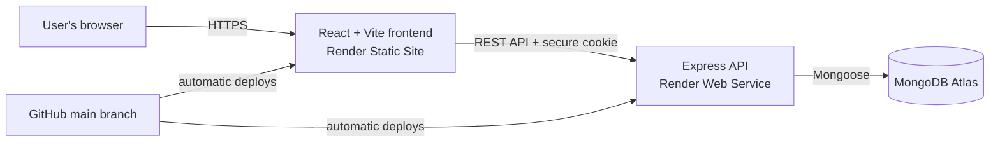

# Finance Tracker

A full-stack personal finance tracker for securely recording income and expenses, understanding monthly spending, and viewing user-specific financial dashboards.

**Live app:** [finance-tracker-f1aa.onrender.com](https://finance-tracker-f1aa.onrender.com)
**Live API:** [finance-tracker-api-2p1p.onrender.com](https://finance-tracker-api-2p1p.onrender.com)

## Highlights

- Secure registration, login, logout, and protected routes
- User-specific transaction data stored in MongoDB Atlas
- Create, edit, and delete income and expense transactions
- Transaction dates, categories, search, filtering, and sorting
- Dashboard totals and a monthly income-versus-expense chart
- Responsive light and dark user interfaces
- Loading states, validation messages, and delete confirmation
- Automated frontend tests, linting, and production builds

## Architecture



The frontend calls the Express API through REST endpoints. The API owns authentication, validation, authorization, and all database access. MongoDB stores users and transactions; the browser never receives database credentials.

## Tech Stack

| Area | Tools |
| --- | --- |
| Frontend | React, Vite, JavaScript, Axios |
| Visualizations | Recharts |
| Backend | Node.js, Express.js |
| Database | MongoDB Atlas, Mongoose |
| Authentication | bcryptjs, JSON Web Tokens, HTTP-only cookies |
| Quality | ESLint, Vitest, React Testing Library |
| Deployment | Render, GitHub |

## Features

### Authentication and privacy

- Passwords are hashed with bcrypt before storage.
- The API creates a seven-day JWT and stores it in an HTTP-only cookie.
- Protected API routes require a valid token.
- Every transaction query is scoped to the authenticated user, so one user cannot read or modify another user's transactions.
- Login and registration attempts are rate limited.

### Financial tracking

- Income is stored as a positive amount and expenses as a negative amount.
- Server-side validation checks titles, categories, types, amounts, and ISO dates.
- Dashboard cards show balance, total income, and total expenses.
- A monthly chart groups transactions by their transaction date.
- Transaction history supports search, type/category filters, and amount/date sorting.

## Project Structure

```text
finance-tracker/
├── src/                         # React frontend
│   ├── components/              # Reusable UI and chart components
│   ├── pages/                   # Authentication and dashboard pages
│   ├── services/                # Axios API client
│   ├── styles/                  # Scoped authentication and dashboard CSS
│   ├── test/                    # Test setup
│   └── utils/                   # Reusable formatters
├── backend/
│   ├── middleware/              # JWT authentication middleware
│   ├── models/                  # User and Transaction schemas
│   ├── routes/                  # Authentication and transaction REST routes
│   └── server.js                # Express app and MongoDB startup
├── .env.example                 # Safe frontend environment template
└── backend/.env.example         # Safe backend environment template
```

## Run Locally

### Prerequisites

- Node.js 22 or later (developed and tested with Node 22.18.0)
- A MongoDB Atlas cluster and database user

### 1. Configure environment variables

Create a frontend environment file from the template:

```bash
cp .env.example .env
```

Create the backend environment file:

```bash
cp backend/.env.example backend/.env
```

In `backend/.env`, provide your own private values:

```env
MONGO_URI=YOUR_MONGODB_CONNECTION_STRING
JWT_SECRET=GENERATE_A_LONG_RANDOM_SECRET
CLIENT_URL=http://localhost:5173
PORT=3001
```

Never commit `.env` files or paste these values into issues, chats, or pull requests.

### 2. Install dependencies

```bash
npm ci
cd backend
npm ci
cd ..
```

### 3. Start the application

Open two terminal windows.

Frontend:

```bash
npm run dev
```

Backend:

```bash
cd backend
npm run dev
```

Open the frontend at `http://localhost:5173`.

## Quality Checks

Run these commands from the repository root:

```bash
npm test
npm run lint
npm run build
```

The initial automated suite contains six tests covering currency/date formatting and transaction-form behavior.

To check backend production dependencies:

```bash
cd backend
npm audit --omit=dev
```

## REST API

All API routes begin with `/api`.

| Method | Endpoint | Access | Purpose |
| --- | --- | --- | --- |
| POST | `/auth/register` | Public | Register a user and set an authentication cookie |
| POST | `/auth/login` | Public | Log in and set an authentication cookie |
| POST | `/auth/logout` | Public | Clear the authentication cookie |
| GET | `/auth/me` | Protected | Get the current user |
| GET | `/transactions` | Protected | Get the current user's transactions |
| POST | `/transactions` | Protected | Create a transaction |
| PUT | `/transactions/:id` | Protected | Update one of the current user's transactions |
| DELETE | `/transactions/:id` | Protected | Delete one of the current user's transactions |

Example create-transaction request body:

```json
{
  "title": "Monthly rent",
  "amount": 1500,
  "category": "Rent",
  "type": "expense",
  "date": "2026-08-20"
}
```

The backend normalizes this expense to `-1500` before storing it.

## Deployment

The application is deployed as two Render services:

- A **Static Site** builds and hosts the Vite frontend.
- A **Web Service** runs the Express API and connects to MongoDB Atlas.

Production configuration is stored only in Render environment variables:

| Service | Variables |
| --- | --- |
| Frontend | `VITE_API_BASE_URL` |
| Backend | `MONGO_URI`, `JWT_SECRET`, `CLIENT_URL`, `NODE_ENV` |

Render's free web-service tier can spin down after inactivity, so the first API request may take longer while it wakes up.

## Security Practices

- Secrets are excluded from Git and provided through environment variables.
- Passwords are hashed; plaintext passwords are never stored.
- JWTs are sent in HTTP-only cookies rather than browser-readable storage.
- CORS only accepts the configured frontend origin and supports credentialed requests.
- Helmet adds security-related HTTP headers.
- Request bodies are limited to 10 KB.
- Authentication endpoints are rate limited.

## Planned Improvements

- Add backend integration tests for API authorization and validation
- Add configurable user-created categories and budget goals
- Add pagination for larger transaction histories
- Add accessible automated UI checks and broader test coverage
- Add a custom domain

## Author

Built by [Raj Amatya](https://github.com/rajamatya1) as a full-stack portfolio project.
